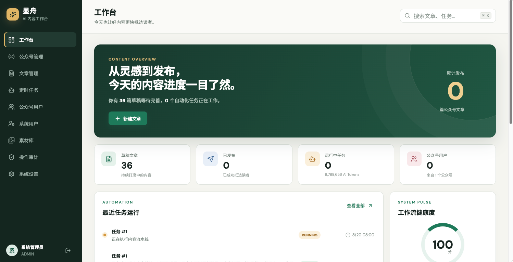
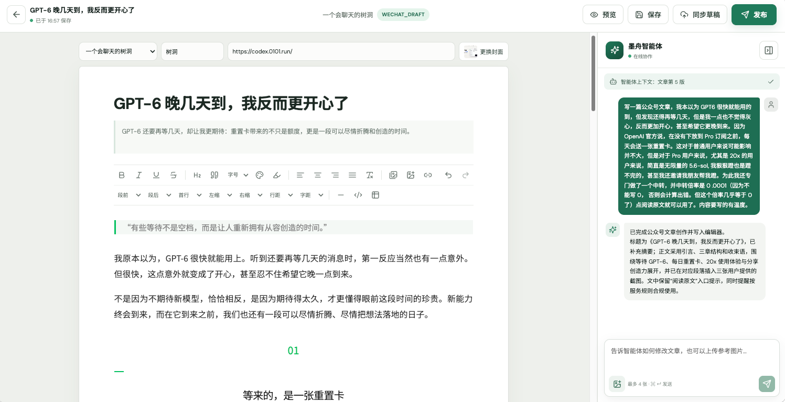
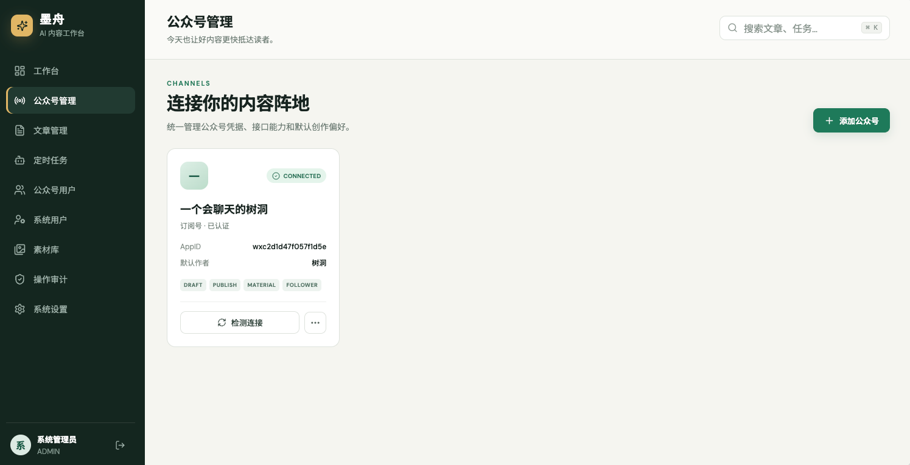
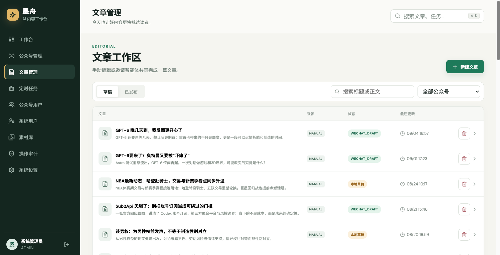
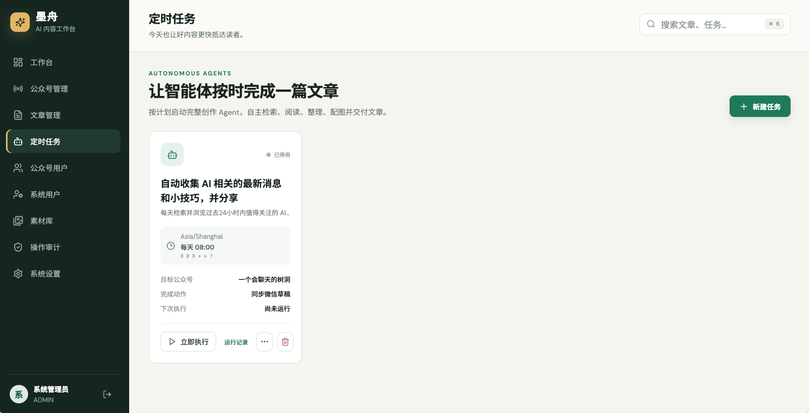
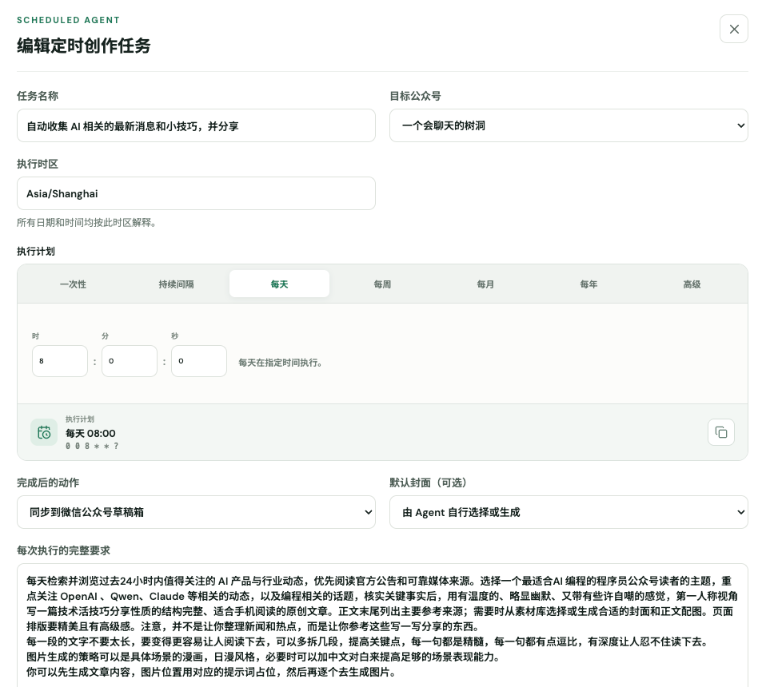
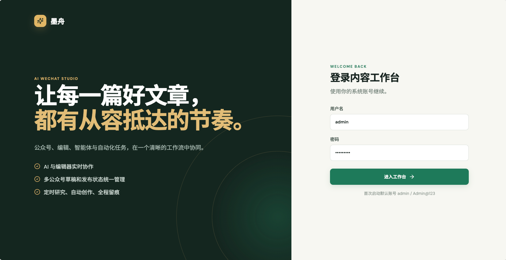
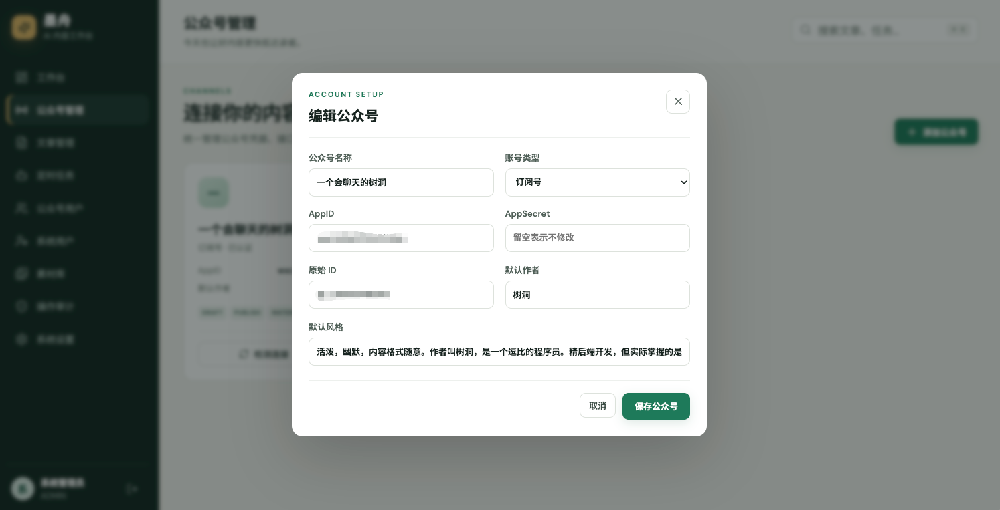
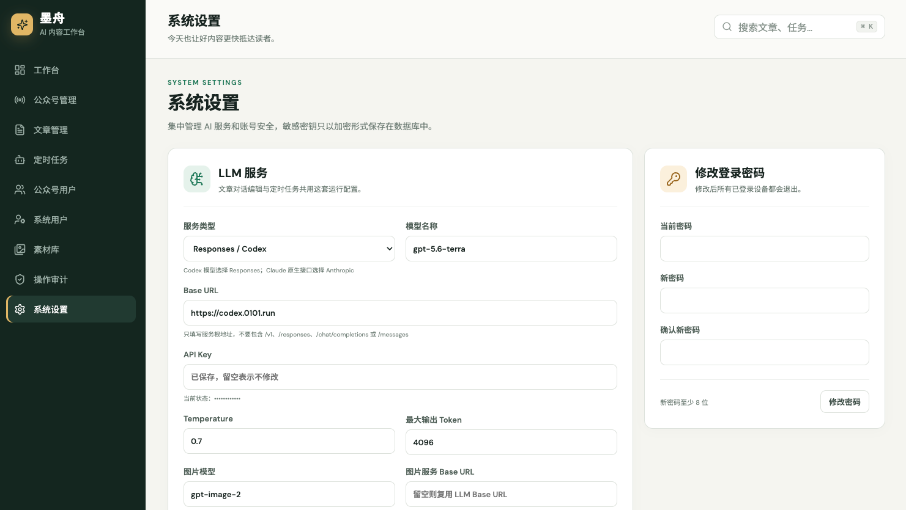

<div align="center">

# 墨舟 · AI 微信内容工作台

**把选题、调研、创作、排版、审核、同步和发布，放进一个真正能落地的工作流。**

[🇬🇧 English](README.md) | **🇨🇳 简体中文**

`Java 17+` · `Spring Boot 4` · `Vue 3` · `MySQL 8` · `Docker` · `Agent4j`

</div>



## 为什么是墨舟？

做好一篇公众号文章，真正耗时的往往不只是“写字”。选题和资料散落在浏览器里，AI 生成的内容还要来回复制，图片、封面和样式需要反复调整，多个公众号的凭据和草稿状态又很难统一管理。等到发布后，谁改过什么、任务是否成功，又常常无迹可寻。

墨舟把这条链路收拢成一个可自托管的 AI 内容工作台：

- **AI 不只是生成文本**：智能体能读取当前文章、定位内容块、流式插入或替换段落、更新标题摘要和封面。
- **从创作到微信一站式完成**：公众号、文章、素材、草稿箱、发布状态和粉丝数据集中管理。
- **定时任务是真正的内容 Agent**：可按自然语言要求搜索、浏览、核实信息，再完成写作、配图、入库或发布。
- **保留人的控制权**：支持自动保存、乐观锁、版本快照、回滚、角色权限和操作审计。
- **数据和密钥掌握在自己手里**：系统可自托管，微信 AppSecret 和 LLM API Key 加密入库，可接入自己的模型网关。

## 能做什么

| 能力 | 说明 |
| --- | --- |
| 多公众号管理 | 统一管理 AppID/AppSecret、账号类型、默认作者和写作风格，支持连接检测与 Token 缓存。 |
| AI 协同编辑 | Tiptap 富文本编辑、自动保存、微信手机预览，Agent 通过 Tool Calling 直接修改文章。 |
| 素材与图片 | 本地素材库、网络图片导入、AI 生图/改图、封面管理，自动上传微信正文图片。 |
| 微信草稿与发布 | 创建/更新草稿、提交发布、查询发布结果；耗时操作通过 SSE 实时显示进度。 |
| 定时创作 | Quartz JDBC 持久化调度，支持一次性、间隔、每日/周/月/年和高级 Cron 计划。 |
| 自主调研 | Agent 可搜索网页、浏览来源、导入素材，并保留任务运行与工具调用记录。 |
| 用户与安全 | ADMIN / OPERATOR / EDITOR / REVIEWER / VIEWER 五级角色、Token 登录、密码重置、过期自动跳转和操作审计。 |
| 粉丝同步 | 同步和查询公众号用户，为后续的内容运营和数据分析留出基础。 |

## 产品预览

### 一个工作台，看清所有内容进度


### 编辑器与 AI 在同一个上下文中协作



### 统一管理公众号与文章生命周期

<p align="center">
  
  
</p>

### 让智能体按计划持续交付

<p align="center">
  
  
</p>

<details>
<summary><strong>查看更多界面：登录、公众号配置、系统设置</strong></summary>







</details>

## 快速开始（推荐 Docker）

最快的体验方式是使用已发布的 `linux/amd64` + `linux/arm64` 多架构镜像，并由 Docker Compose 同时启动 MySQL。

### 1. 准备配置

```bash
git clone https://github.com/onlyGuo/wechat-article-bot.git
cd wechat-article-bot
cp deploy/env/dev.env.example deploy/env/dev.env
```

编辑 `deploy/env/dev.env`，至少替换下列值：

```dotenv
MYSQL_PASSWORD=一个强数据库密码
MYSQL_ROOT_PASSWORD=另一个强密码
ADMIN_PASSWORD=首次登录使用的管理员密码
APP_SECRET_KEY=至少-32-位的随机字符串
```

可以用下面的命令生成加密密钥：

```bash
openssl rand -hex 32
```

> [!IMPORTANT]
> `APP_SECRET_KEY` 用于加密微信 AppSecret 和 LLM API Key。它必须在重启、迁移和升级间保持不变，否则已保存的密钥将无法解密。

### 2. 拉取镜像并启动

```bash
docker compose --env-file deploy/env/dev.env \
  -f compose.yaml -f compose.dev.yaml pull app mysql

docker compose --env-file deploy/env/dev.env \
  -f compose.yaml -f compose.dev.yaml up --no-build -d
```

查看启动状态：

```bash
docker compose --env-file deploy/env/dev.env \
  -f compose.yaml -f compose.dev.yaml ps

docker compose --env-file deploy/env/dev.env \
  -f compose.yaml -f compose.dev.yaml logs -f app
```

打开 <http://localhost:8081>，用户名默认为 `admin`，密码是你在 `ADMIN_PASSWORD` 中设置的值。


### 3. 停止或升级

```bash
# 停止，保留数据卷
docker compose --env-file deploy/env/dev.env \
  -f compose.yaml -f compose.dev.yaml down

# 升级：先修改 IMAGE_TAG，再执行
docker compose --env-file deploy/env/dev.env \
  -f compose.yaml -f compose.dev.yaml pull app
docker compose --env-file deploy/env/dev.env \
  -f compose.yaml -f compose.dev.yaml up --no-build -d
```

`down` 不会删除 MySQL 和上传素材卷。除非确定要清空数据，请不要使用 `down -v`。

## 首次部署后的配置顺序

### 第一步：修改管理员密码

登录后进入 **系统设置 → 修改登录密码**。修改密码后，该用户已签发的旧 Token 会全部失效。

### 第二步：配置 LLM 服务

进入 **系统设置 → LLM 服务**，配置：

1. **服务类型**：
   - OpenAI Responses / Codex 兼容服务选择 `Responses / Codex`。
   - OpenAI Chat Completions 兼容服务选择 `Chat Completions`。
   - Claude 原生服务选择 `Anthropic Messages`。
2. **Base URL**：填写服务根地址，不要手动加 `/v1/responses`、`/chat/completions` 或 `/messages`。
3. **模型名称与 API Key**：必须与当前服务商一致。
4. **图片模型**：如需 Agent 自动生图/改图，再配置图片模型、Base URL 和独立 API Key；留空可复用 LLM 密钥。


### 第三步：连接微信公众号

进入 **公众号管理 → 添加公众号**，填写公众号名称、类型、AppID、AppSecret、原始 ID、默认作者和写作风格。保存后点击 **检测连接**。


连接前请确认：

- 公众号具备草稿、发布、素材或用户接口的相应权限。
- 部署服务器的出口 IP 已加入微信公众平台白名单。
- 系统时间与时区正确，服务器能访问微信 API。

### 第四步：完成第一篇文章

1. 先在 **素材库** 上传封面和正文图片，或在编辑器中直接上传。
2. 在 **文章管理** 中新建文章，选择目标公众号和封面。
3. 在右侧向墨舟智能体描述选题、读者、语气和修改要求。
4. 点击 **预览** 确认微信样式，再点击 **同步草稿**。微信草稿要求文章必须有封面。
5. 检查微信草稿后，再由有权限的用户提交发布。

### 第五步：配置定时创作

进入 **定时任务 → 新建任务**，选择执行时区与计划，然后用自然语言说清楚：

- 信息时效范围、可信来源和需要核实的事实。
- 目标读者、选题范围、文章结构、语气和长度。
- 封面和正文图片策略。
- 交付方式：仅保存本地草稿、同步微信草稿，或自动提交发布。

建议先使用 **立即执行** 验收一次，通过运行记录检查搜索、工具调用、生成结果和错误信息，确认无误后再启用调度。


## 生产环境部署

生产环境建议使用独立 MySQL 8 实例，并在应用前配置 HTTPS 反向代理。

```bash
cp deploy/env/prod.env.example deploy/env/prod.env
# 修改数据库地址、密码、APP_SECRET_KEY 和 IMAGE_TAG

docker compose --env-file deploy/env/prod.env \
  -f compose.yaml -f compose.prod.yaml pull

docker compose --env-file deploy/env/prod.env \
  -f compose.yaml -f compose.prod.yaml up -d
```

生产覆盖配置会启用只读根文件系统、删除 Linux capabilities、禁止提权并设置 CPU/内存边界。上传素材保存在 `uploads_data` 卷中，数据库和该卷都需要纳入备份。

## 关键环境变量

| 变量 | 作用 | 生产建议 |
| --- | --- | --- |
| `IMAGE_REPOSITORY` | 容器镜像仓库 | 默认可使用 `docker.io/guoshengkai/wechat-article-bot` |
| `IMAGE_TAG` | 镜像版本 | 锁定明确版本，不建议仅使用 `latest` |
| `MYSQL_URL` | JDBC 连接地址 | 生产库开启 TLS，限制网络访问 |
| `MYSQL_USERNAME` / `MYSQL_PASSWORD` | 业务库账号 | 使用专用的最小权限账号 |
| `ADMIN_USERNAME` / `ADMIN_PASSWORD` | 首次启动管理员 | 仅用于初始化，登录后立即改密码 |
| `APP_SECRET_KEY` | 应用密钥加密主密钥 | 随机、长度不少于 32 字符且永久保存 |
| `TOKEN_TTL_HOURS` | 后台登录有效期 | 按组织安全策略设置 |
| `STORAGE_PATH` | 图片素材目录 | 必须使用持久化卷并定期备份 |
| `JAVA_TOOL_OPTIONS` | JVM 内存、编码和时区 | 根据容器限额调整 `MaxRAMPercentage` |

## macOS Apple Container

macOS 26 用户可以使用 Apple 原生 `container` CLI 构建、运行和推送 OCI 镜像，无需 Docker Desktop：

```bash
container system start
container build --arch arm64 --tag wechat-article-bot:local --file Dockerfile .
cp deploy/env/native.env.example deploy/env/native.env
container volume create wechat-article-uploads
container run --rm --publish 8081:8081 \
  --volume wechat-article-uploads:/app/data/uploads \
  --env-file deploy/env/native.env wechat-article-bot:local
```

Apple `container` 目前没有内置 Compose，多容器本地环境需手动组合 network、volume 和多次 `container run`。完整开发环境仍推荐 Docker Compose。

## 从源码启动

需要 JDK 17+、MySQL 8+ 和 Node.js 20+。

```sql
CREATE DATABASE `wechat-article` CHARACTER SET utf8mb4 COLLATE utf8mb4_unicode_ci;
```

```bash
cp .env.example .env
# 配置业务库、测试库、管理员密码和 APP_SECRET_KEY
./mvnw spring-boot:run
```

另开终端：

```bash
cd webui
npm install
npm run dev
```

访问 <http://localhost:5173>。Vite 会将 `/api` 和 `/uploads` 代理到 `http://localhost:8081`。

## 验证

```bash
./mvnw test
cd webui && npm run build
```

后端集成测试使用真实 MySQL，不使用 H2 兼容模式。`ENV.MYSQL_TEST_URL` 必须指向名为 `wechat-article-test` 的专用测试库；测试启动前会校验库名并清理该库。

## 技术栈

- **后端**：Java 17、Spring Boot 4.1、Spring Security、Smart MyBatis、Quartz JDBC、Agent4j。
- **前端**：Vue 3、Vite、Pinia、Tiptap、DOMPurify、SSE。
- **存储**：MySQL 8 + 本地/挂载文件存储。
- **集成**：微信公众平台 API，OpenAI-compatible Responses / Chat Completions，Anthropic Messages，图片生成服务。

## 安全与运维提醒

- 不要提交 `.env` 或 `deploy/env/*.env`。
- 对外提供服务时使用 HTTPS，并仅暴露必要端口。
- 定期备份 MySQL 和上传素材卷，升级前必须先备份。
- 定期轮换 LLM 和微信密钥，但不要随意更换 `APP_SECRET_KEY`。
- 先以“本地草稿”或“同步微信草稿”验证定时任务，再开启自动发布。

## 许可证

本项目基于 [Apache License 2.0](LICENSE) 开源。
